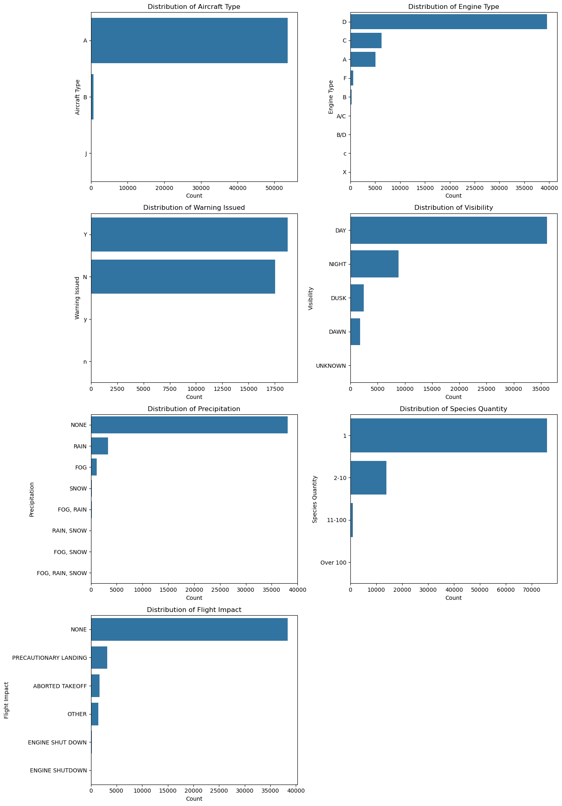
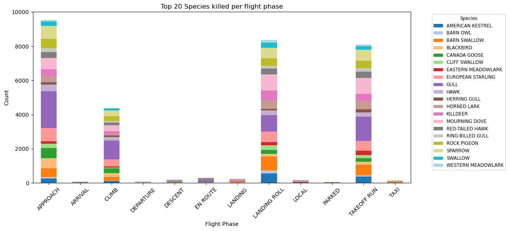
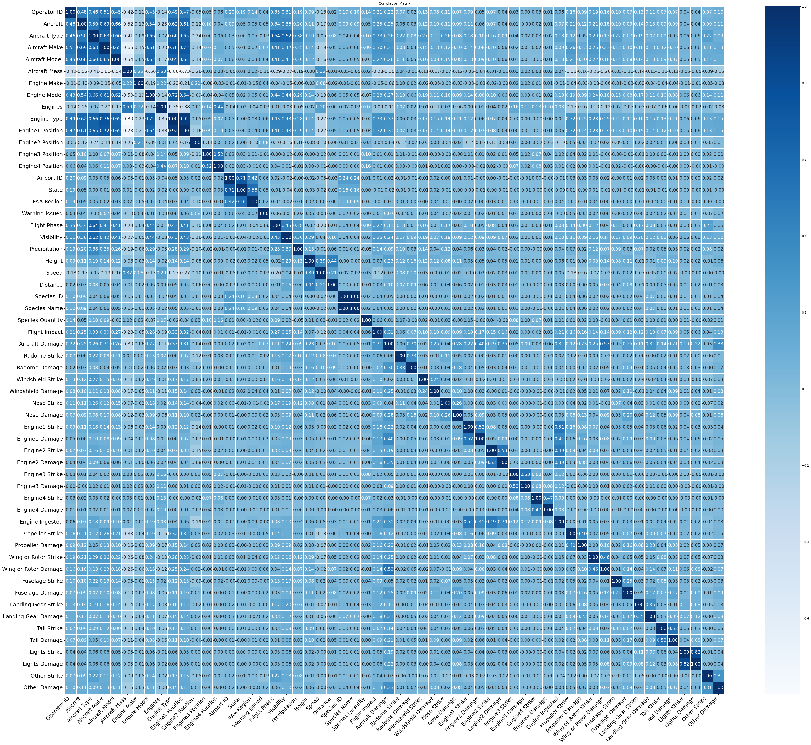

# Outline of Readme.md markdown file: (This constitutes the majority of your documentation)
Aircraft wildlife strikes are a major safety concern in aviation. This project predicts the most likely animal species involved in a strike based on factors like flight phase, location, and altitude.

# Describe the dataset(s) used.
    https://wildlife.faa.gov/assets/fieldlist.pdf
Based on the provided dataset, here's the expected data type for each of the columns:

1. **Record ID**: `Integer` Individual record number
2. **Incident Year**: `Integer` Year strike occurred
3. **Incident Month**: `Integer` Month strike occurred
4. **Incident Day**: `Integer` Date strike occurred
5. **Operator ID**: `String` Airline operator code
6. **Operator**: `String` Civil Aviation Organization Name
7. **Aircraft**: `String` Aircraft
8. **Aircraft Type**: `String` Type of aircraft
9. **Aircraft Make**: `String` International Civil Aviation Organization code for Aircraft Make
10. **Aircraft Model**: `String` International Civil Aviation Organization code for Aircraft Model
11. **Aircraft Mass**: `Integer` 1 = 2,250 kg or less: 2 = ,2251-5700 kg: 3 = 5,701-27,000 kg: 4 = 27,001-272,000 kg: 5 = above 272,000 kg
12. **Engine Make**: `String` Engine Make Code
13. **Engine Model**: `String` Engine Model Code
14. **Engines**: `Integer` Number of engines
15. **Engine Type**: `String` Type of power A = reciprocating engine (piston): B = Turbojet: C = Turboprop: D = Turbofan: E = None (glider): F = Turboshaft (helicopter): Y = Other
16. **Engine1 Position**: `String` Where engine # 1 is mounted on aircraft
17. **Engine2 Position**: `String` Where engine # 2 is mounted on aircraft
18. **Engine3 Position**: `String` Where engine # 3 is mounted on aircraft
19. **Engine4 Position**: `String` Where engine # 4 is mounted on aircraft
20. **Airport ID**: `String` International Civil Aviation Organization airport identifier for location of strike whether it was on or off airport
21. **Airport**: `String` Name of airport
22. **State**: `String` State
23. **FAA Region**: `String` FAA Region where airport is located
24. **Warning Issued**: `String` Pilot warned of birds/wildlife
25. **Flight Phase**: `String` Phase of flight during which strike occurred
26. **Visibility**: `String` Type of cloud cover, if any
27. **Precipitation**: `String` Precipitation
28. **Height**: `Integer` Feet Above Ground Level
29. **Speed**: `Float` Knots (indicated air speed)
30. **Distance**: `Float` Nautical miles from airport
31. **Species ID**: `String` International Civil Aviation Organization code for type of bird or other wildlife
32. **Species Name**: `String` Common name for bird or other wildlife
33. **Species Quantity**: `Integer`
34. **Flight Impact**: `String` Impact on the flight
35. **Fatalities**: `Integer` Number of human fatalities
36. **Injuries**: `Integer` Number of people injured
37. **Aircraft Damage**: `Integer`
38. **Radome Strike**: `Integer`
39. **Radome Damage**: `Integer`
40. **Windshield Strike**: `Integer`
41. **Windshield Damage**: `Integer`
42. **Nose Strike**: `Integer`
43. **Nose Damage**: `Integer`
44. **Engine1 Strike**: `Integer`
45. **Engine1 Damage**: `Integer`
46. **Engine2 Strike**: `Integer`
47. **Engine2 Damage**: `Integer`
48. **Engine3 Strike**: `Integer`
49. **Engine3 Damage**: `Integer`
50. **Engine4 Strike**: `Integer`
51. **Engine4 Damage**: `Integer`
52. **Engine Ingested**: `Integer`
53. **Propeller Strike**: `Integer`
54. **Propeller Damage**: `Integer`
55. **Wing or Rotor Strike**: `Integer`
56. **Wing or Rotor Damage**: `Integer`
57. **Fuselage Strike**: `Integer`
58. **Fuselage Damage**: `Integer`
59. **Landing Gear Strike**: `Integer`
60. **Landing Gear Damage**: `Integer`
61. **Tail Strike**: `Integer`
62. **Tail Damage**: `Integer`
63. **Lights Strike**: `Integer`
64. **Lights Damage**: `Integer`
65. **Other Strike**: `Integer`
66. **Other Damage**: `Integer`

# Sample values for the categorical features
1	Aircraft	[B-757-200, DC-9, UNKNOWN, F-16, B-737-200, HA...]
2	Aircraft Type	[A, nan, B, J]
3	Aircraft Make	[148, 583, nan, 561, 443, 729, 395, 123, 70, 3...]
4	Aircraft Model	[26, 90, nan, 13, 30, 24, 23, 14, 20, 3, 8, 2,...]
5	Engine Model	[40, 10, nan, 1, 19, 37, 7, 4, 3, 34, 52, 31, ...]
6	Engine Type	[D, nan, B, A, C, F, B/D, A/C, c, X]
7	Engine1 Position	[1, 5, nan, 7, 4, 6, 2, 3, C]
8	Engine3 Position	[nan, 1, 5, 4, CHANGE CODE, 3]
9	Airport ID	[KCVG, PHLI, KJAX, KMCO, KJWN, KFSM, KMSY, KIK...]
10	State	[KY, HI, FL, TN, AR, LA, MI, NJ, MN, nan, NY, ...]
11	FAA Region	[ASO, AWP, ASW, AGL, AEA, nan, ACE, FGN, ANM, ...]
12	Warning Issued	[nan, N, Y, n, y]
13	Flight Phase	[CLIMB, TAKEOFF RUN, nan, LANDING ROLL, APPROA...]
14	Visibility	[nan, DAY, NIGHT, DUSK, DAWN, UNKNOWN]
15	Precipitation	[nan, NONE, FOG, RAIN, SNOW, FOG, RAIN, FOG, S...]
16	Species Quantity	[1, 2-10, nan, 11-100, Over 100]
17	Flight Impact	[nan, PRECAUTIONARY LANDING, OTHER, ABORTED TA..]
18  Operator ID	[DAL, HAL, UNK, MIL, USA, BUS, SWA, PVT, UPS, ...]

# Outline what you plan to predict.  How might this prediction be used in production or in practice?
We want to predict the type of species that will be injured based on the flight phase, the distance form airport, the state, the Visibility and others. This prediction can help Aviation build a system to block these animals based on the phases. Already Some airoprts use Bird Deterrent Systems like Predator calls (e.g., hawk or falcon cries), Distress calls of the birds themselves, Pyrotechnic sounds (like loud bangs). But they dont do much in mid flight because most birds dont flight in high altitude but on the take off and such they usually encounter birds and other animal.

We can further this study by monitoring animal (mostly bird movement) patterns and combining that data with the animal that our model predict and make precautions.

# Process overview 
This is where you can discuss any iterative approaches, mis-steps or pivoting you made during the course of the project.

At first we had select the columns by just the feel rather than the number. We had to redo everything after that. We also faced huge issue when training the model. 

**EDA**
# What are your X and Y variables?
Y variable is Species Name
X are the rest of the columns above.

# Classification or regression?  
It is classifcation. 

# How many observations?
We have 174104 samples which was reduced by dropping Null species, 351 species were dropped afterwards because some species have very small number of entry the other were made to be balanced using SMOTE.

# What is the distribution of each feature?  You don't need to show every feature's distribution.  Focus on features which are imbalanced or may present a problem when training a model.

# Dist of Y

To balance we did SMOTE. Before SMOTE it was (5278, 37) and after SMOTE it is (5744, 37). 
So we have 359 species each with 16 entries in them.

# Correlation - are some features strongly correlated?  
'Aircraft Make', 'Aircraft Model', 'Engine Model', 'Engines', 'Engine Type', 'Engine1 Position', 'State', 'FAA Region', 'Flight Phase', 'Visibility', 'Species Name', 'Engine1 Damage', 'Engine2 Damage', 'Engine3 Damage', 'Engine Ingested', 'Wing or Rotor Damage', 'Tail Damage', 'Lights Damage' are highly correlated. 

# Feature importance. - Are you using all features for X? If so, make a case for that. If not, make a case for the feature selection you used.
NO, it wasn’t necessary to  use all of them for our target variable. Features post-impact are not relevant in our pre-incident predictive study. So, I excluded everything post-impact and the damages as well since our primary focus was on the species group. We did perform a PCA but overall, background and non-statistical knowledge was important. 

Features used: 'Species Group', 'Incident Month', 'Flight Phase Cleaned','Aircraft Mass', 'Engine Type Cleaned', 'State', 'Height', 'Speed'

# Feature engineering
# Which features needed feature engineering?  Discussion:
Looking at numerical features: Height, aircraft mass and speed underwent scaling and had their missing values handled via median imputation. Then regarding categorical variables they were bucketed: Flight Phase, State, engine type and Species Name was consolidated into broader groups. 

# Label encoding vs. one hot encoding? 
All catergorical variables were encoded by One-Hot Encoding. 

# Cross features? More advanced encoding / feature engineering you might have completed.
We did not do any cross features but after going through the models maybe height and speed as they had the highest influence on predicting the target variables. 

# Model fitting
# Train / test splitting - How was this performed? How did you decide the train/test sizes?
I did the standrad 80% training data and 20% testing split, stratisfied by Species Group. The dataset size was sufficient enough to do this. 

# Does your dataset have a risk of data leakage? Describe those risks.
YES, it does. If we had decided to focus on time like seasons and then had to order it. Another major one was using scaler-imputations before splitting but that is why we only fitted it on the training data ONLY. 

# Which model did you select, why?
despite having tried 4 models, we went with Random Forest at the end due to its high recall (more important for airplane companies) and auc score and other metrics. 

# Many have tried multiple model types - what is the thought process for trying these types?
We tried Log Reg at first as a baseline to see the data's linear relationships and other factors. Then we proceed to Linear SVC, worked better for the large dataset with linear patterns but theere was still an issue with distaigusihing betweeb classes especially for known small birds and other smaller groups that made the data heavily imbalanced and why we resorted to SMOTE and decreased granularity in categorical bucketing earlier. From then we jumped a decsion tree to see if Random Forest would do any better and it did, in all aspects and that's why its our frontrunner. For hyper-parameter tuning for optimization, grid search was used. 

# Only use models learned in class (linear regression, logistic regression, SVC/SVM, decision trees (including random forests, etc)
# What was the process for hyper parameter selection if applicable?  
For hyper-parameter tuning for optimization, grid search was used for log and svc.

# Validation / metrics
# Which metrics did you weigh most heavily, why? - Accuracy, r^2, balanced accuracy, ROC, AUC, Recall, Precision, etc..
We used RECALL (Macro Avg) because our class is very imbalanced. AUC for model performances and log-loss helped in measuring how well each model's probabilty outputs matched with real-life. We also had accurancy, precison and others metrics obtrained from the classifiaction report. 

# Confusion matrix and confusion discussion for classification problems
Additionally we used confusion matrixes too. Looking at the different matrices across the different models, there are a few clear takeaways. Random Forest does the best job handling UNKNOWN classes, with high true positive counts for UNKNOWN MEDIUM BIRD and UNKNOWN SMALL BIRD. In contrast, Logistic Regression and SVC struggles significantly with these, often scattering predictions across multiple classes. Rare animals are another challenge—every model misclassifies them frequently, especially into categories like Gulls and Pigeons. This likely points to class imbalance or overlapping features, which might need additional feature engineering or resampling.

Logistic Reg showed the most class confusion overall, with predictions spread too broadly and a lack of clear separations—especially for Gulls & Water Birds. Decision, though better, still overfits and mispredicts them in huge numbers. Random Forest helps mitigate this issue by capturing non-linear patterns more effectively, making it the strongest choice for handling these types of classifications.

One trend across all the models is the high confusion between visually similar bird types, like Swallows & Swifts, Small Land Birds, and Raptors. These misclassifications make sense given real-world similarities in size, flight patterns, and habitat. If interpretability is a priority, grouping certain species or extracting more distinguishing features could improve accuracy. While Random Forest comes out better, refining class definitions and balancing dataset representation will be key for future improvements.

# Highlight model weaknesses
# Give 2-4 prediction examples from your data.
# Give 2 prediction examples which are new or synthesized. 
The overall concensus is each of these poorly performs on rarer classes and may over-relies on height and scv on speed. So more weight on numerical features than contextual ones. 

# Overfitting/Underfitting
# 1. Identify if model is overfitting or underfitting
# 2. Identify and apply techniques to mitigate underfitting/overfitting
Underfitting on minority classes was cleared by SMOTE and/or "weight' = "balanced". 

# Production
# 1. Give any advice for deployment of use of this model --> Outline precautions about its use here and Going further.
If there are new bird species or major aircraft design changes that are not in training, this will cause a problem so this must be monitored. 

# What could make this model better? More data, additional features, more augmentation etc.
Some kind of Boosting like Gradient Boost would be helpful here and for data, more records of weather conditions wouldve helped. I think knowing bird migration seasons and patterns would help this a lot since State did have some statistical influence. 

